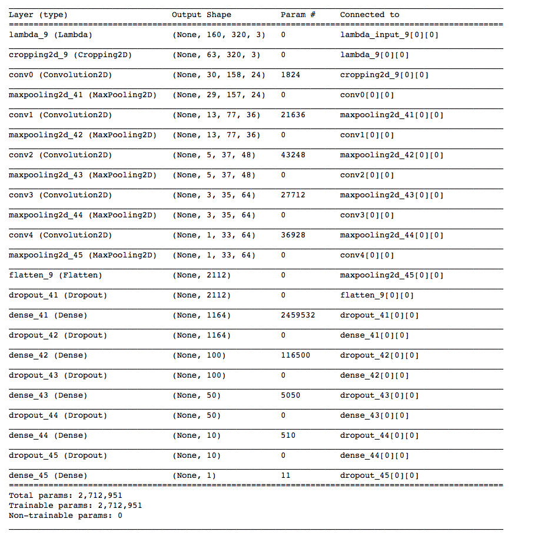
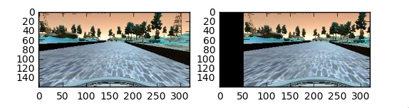
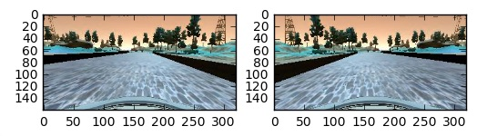
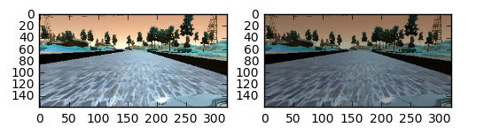

## **Behavioral Cloning Project**

The goals / steps of this project are the following:

* Use the simulator to collect data of good driving behavior
* Build, a convolution neural network in Keras that predicts steering angles from images
* Train and validate the model with a training and validation set
* Test that the model successfully drives around track one without leaving the road
* Summarize the results with a written report


## Rubric Points
### Here I will consider the [rubric points](https://review.udacity.com/#!/rubrics/432/view) individually and describe how I addressed each point in my implementation.

---
---
### Files Submitted & Code Quality

#### 1. Submission includes all required files and can be used to run the simulator in autonomous mode :heavy_check_mark:

My project includes the following files:

* `model.py`: Contains the script to create and train the model.
* `drive.py`: File used for driving the car in autonomous mode.
* `model.h5`: Contains a trained convolution neural network.
* `writeup_report.md`: Summarizing my results and findings... and frustrations. :stuck_out_tongue_winking_eye:

#### 2. Submission includes functional code :heavy_check_mark:
Using the Udacity provided simulator and my drive.py file, the car can be driven autonomously around the track by executing

```
python drive.py model.h5
```

#### 3. Submission code is usable and readable :heavy_check_mark:

The `model.py` file contains the code for training and saving the convolution neural network. The file shows the pipeline I used for training and validating the model, and it contains comments to explain how the code/functions works.

---
---
### Model Architecture and Training Strategy

#### 1. An appropriate model architecture has been employed :heavy_check_mark:

The model architecutre was inspired from the following sources:

* [NVIDIA CNN's Architecture](http://images.nvidia.com/content/tegra/automotive/images/2016/solutions/pdf/end-to-end-dl-using-px.pdf)
* [Udacity's Self Driving Car Q & A | Behavior Cloning Youtube Video](https://www.youtube.com/watch?v=rpxZ87YFg0M).

Data normalization in the model was done using Kera's Lambda Layer and Kera's Convolutional Cropping Layer. This was done in the Q & A and it worked really well from the "get go" so I decided to continue with it throughout the project.

The model consists of depth 24, 36, 48, and 64 with 5x5 filters and 3x3 filters (`model.py` lines 193 - 206). This model includes the use of RELU layers within the Convolutional Layers and Fully Connected Layers (`model.py` lines 193 - 206). It also includes a deeper Fully Connected Layer with "neurons" descending from 1124 to 1 (`model.py` lines 209 - 218). Additionally, within the Fully Connected Layers, Dropout is introduced with a rate of `0.2` (`model.py` lines 209 - 218).


### 2. Attempts to reduce overfitting in the model :heavy_check_mark:

To reduce overfitting in the model, Dropout was introduced in the dense layers. I originally started with a modest dropout rate (`0.5`) but, I kept having issues on sharp turns. Once I reduced it to the rate of `0.2`, it appeared to help.

The model was trained and validated on different data sets to ensure that the model avoided overfitting (`model.py` lines 32).


#### 3. Model parameter tuning

The model used an Adam Optimizer with a learning rate of `0.0001`.  (`model.py` line 219-220).


#### 4. Appropriate training data

The training data chosen for this project was actually the data provided from Udacity. I had tried training with my own recordings, which encompassed two full laps fowards and backwards with a combination of recovering from left and right sides of the road. Ultimately, the model I had created worked best the Udacity Data.

The data I had created as well was also very heavy, creation of the model took much longer becasue of the amount of data. I was unable to successfully use AWS and Floyd.

Training data was chosen to keep the vehicle driving on the road. I used a combination of center lane driving, recovering from the left and right sides of the road ...


### Model Architecture and Training Strategy

#### 1. Solution Design Approach

The overall strategy for deriving a model architecture was to use what works from the previous proejcts and some help from NVIDIA.

So the first step was to use a convolutional neural network model similar to that of NVIDIA and fill in some possible "gaps" with what we accomplished in the Traffic Sign Classifier Project. The NVIDIA acted a AlexNet in some respects, acting as a backbone to build upon.

In order to combat overfitting (initial models had a low mean squared error on the training set but a high mean squared error on validation set), dropout was introduced in the dense layers.

Around this point, I went back and forth between datasets. I tried learning from my own dataset vs. the data provided by Udacity. Udacity's data favored more favorable in the end to the model created.

The final step was to run the simulator to see how well the car was driving around track one. I had the biggest issue on the sharp turns for quite some time. My first attempt to solve this issue was by adding additional data on those sharp turns, which still did not improve my model. Upon doing further research, I found that it was rate of my dropout that could be impacting my sharp turns. When I reduced the rate of the dropout from `0.5` to `0.2`, my model was successfully able to attempt the sharp turns.

At the end of this long and sometimes frustrating process, I was able to drive autonomously around the track without leaving the road, even correcting itself at times. :tada: :tada: :tada:


#### 2. Final Model Architecture

Here is a visualization of the architecture:




#### 3. Creation of the Training Set & Training Process

Initially, I had created my own dataset under `trained_data` but my model was not working properly with that dataset. I then decided to focus on what Udacity had provided and was able to move closer to a model that would produce a successful lap around the track 1. I think I was just really bad at learning how to drive this simulator.

To augment the dataset, I did the following:

* **Shifting Images:** Based off what I understood from the NVIDIA paper, shifting the image allows us to get another set of various data points. By shifting, we are moving the image in the x-axis direction. In the case of NVIDIA's paper, I believe they use this to help steer the vehicle back to the desired location and orientation.



* **Flipping Image:** By shifting the data, we are able to agument and balance left and right angles.



* **Brightness Augmentation:** This will come in handy for track 2 because track 1 is much brighter than track 2. Track 2 has added trees, hills, etc. that cause shadows.



After separating the csv from a sample of 8026 (rows within csv), I had 6428 rows for training and 1608 for validation. I believe that gives us 19,284 for images within the training set (includes center, left and right) and 4,824 for images within the validation ste (includes center, left, and right).

Within the training generator, I do multiple shuffles. I do a shuffle prior to separating batches and as I `yield` the `X_train` (images) and `y_train` (steering angles) datasets.

I use this training data to tarin the model. The validation set helps determine fi the model was over or under fitting. The ideal number of epochs for my model was 5 as evidence of my completetion of a lap around track 1. As for the optimizer used within compiling the model, I used the adam optimizer with a learning rate of `0.0001`. I know the adam optimizer would handle that learning rate for itself but at some point during many iterations of training, I manually set it and left it as is.


---
#### Final Thoughts:
I think this project was truly a test of patience and endurance. I was unforunately unable to `scp` my files to my Amazon ec2 instance so my progress was a lot harder and more painful. I even tried to work with the Floyd service but that also did not cooperate with me. So while this project was rewarding, I think a little more emphasis should go into prepping us for the behemoth that is Amazon. Granted I am familiar with it and have had experience with it, it still has it's hiccups that can trip people as myself up from time to time.

---
#### Improvements/Next Steps:
* I did a bit of research and had seen that some people had moved to using ELUs. I am curious if that would help improve my model. I may try that next.
	* [Source 1](https://medium.com/@jmitchell1991/behavioral-cloning-self-driving-car-simulation-14531358c87e#.ger1fptta)
	* [Source 2](https://arxiv.org/pdf/1511.07289v1.pdf)
* I want to continue to dig into why my dataset had so much trouble with my network while Udacity's dataset seem to compile.
* Look into shadows as another preprocessing step for Track 2.

